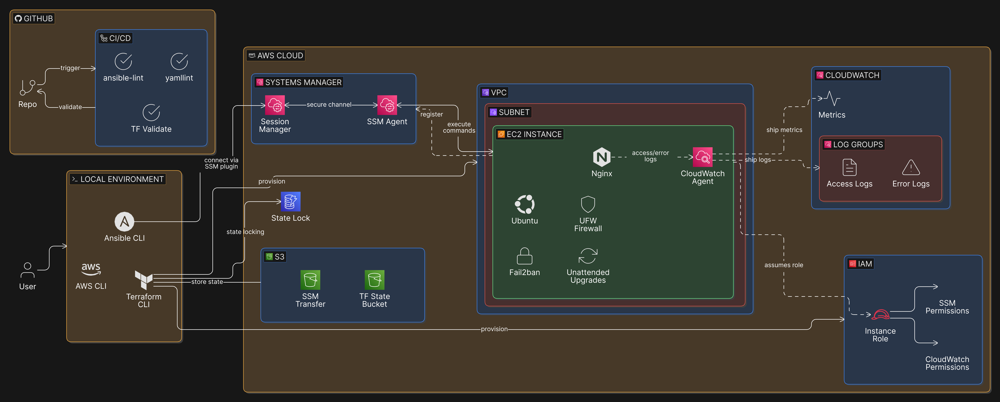
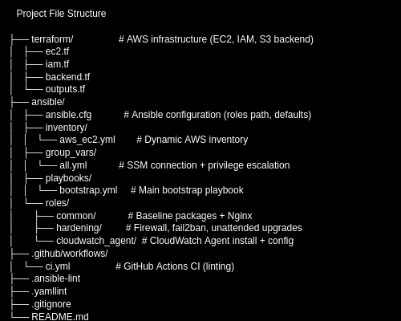

# Ansible + AWS SSM Bootstrap (No SSH)

This project demonstrates a secure, production-style approach to provisioning and bootstrapping EC2 instances **without SSH**, using modern AWS-native access patterns and automation best practices.

Infrastructure is provisioned with Terraform, while configuration and hardening are performed with Ansible over **AWS Systems Manager (SSM)**. Observability is enabled via the CloudWatch Agent, shipping logs and metrics without opening inbound management ports.

## Why Ansible in This Project

In this project, Ansible is responsible for **post-provisioning system configuration, hardening, and operational readiness** of EC2 instances after infrastructure has been created by Terraform.

While Terraform defines *what infrastructure exists*, Ansible defines *how systems behave once they are running*.

### What Ansible Is Doing Here

Ansible performs the following responsibilities:

- **Bootstraps the operating system** by installing baseline and operational packages
- **Configures application services** (Nginx) and verifies runtime health
- **Applies security hardening** including firewall rules (UFW), unattended upgrades, and fail2ban
- **Installs and configures observability tooling** (CloudWatch Agent) to ship logs and metrics
- **Manages configuration idempotently**, ensuring repeated runs converge on the desired state
- **Executes entirely over AWS Systems Manager (SSM)** — no SSH keys, no inbound management ports

All configuration is organized into **Ansible roles**, allowing clear separation of concerns and reuse across environments and hosts.

---

### Why Ansible Was Chosen

Ansible was selected because it excels at **system configuration and operational control**, especially in environments where:

- Hosts are **ephemeral**
- SSH access is restricted or prohibited
- Auditability and repeatability are required
- Configuration must be human-readable and reviewable

Key benefits of using Ansible in this design:

- **Agentless execution:** No daemon required on the target host
- **Idempotency by default:** Safe re-runs without unintended side effects
- **Declarative intent:** Configuration describes the desired end state, not imperative scripts
- **Strong ecosystem:** Mature modules for Linux hardening, service management, and cloud integrations
- **Readable automation:** YAML-based structure that doubles as documentation

Using Ansible over SSM aligns with modern cloud security models by eliminating SSH while still enabling full operational control.

---

### Why Not Do This in Terraform or User Data?

This project intentionally separates concerns:

- **Terraform** provisions infrastructure and IAM
- **Ansible** manages system state and runtime configuration

Terraform is not well-suited for:
- Managing OS-level package state
- Applying conditional logic based on runtime state
- Re-running safely after initial provisioning
- Handling service lifecycle operations

Ansible is purpose-built for these responsibilities and provides better safety, clarity, and maintainability for ongoing operations.

---

### How This Pattern Scales Beyond This Project

The Ansible design in this repository is **cloud-agnostic** and **provider-neutral**.

While AWS SSM is used as the transport layer here, the same roles and playbooks can be executed via:

- SSH (traditional environments)
- Bastion hosts
- On-prem systems
- Other cloud providers (Azure, GCP, OpenStack)
- Air-gapped or restricted networks

Only the **connection method changes** — the automation itself remains the same.

This makes Ansible a powerful abstraction layer between **infrastructure provisioning** and **system operations**, enabling consistent behavior across heterogeneous environments.

---

### Real-World Translation

This exact pattern is commonly used in:

- Regulated enterprise environments
- Government and defense systems
- Zero-trust networks
- High-security cloud workloads
- Hybrid and multi-cloud platforms

By using Ansible for configuration and hardening, this project demonstrates skills that translate directly to real production environments where:
- SSH is disabled
- Access must be auditable
- Systems must self-document their configuration
- Automation must be safe, repeatable, and portable

---

## What this repo demonstrates

- **Secure access patterns:** EC2 managed exclusively via **AWS Systems Manager (SSM)** — no SSH keys, no inbound admin ports.

- **Infrastructure as Code (IaC):** Terraform provisions networking, IAM, EC2, and SSM prerequisites with repeatable deployments.

- **Configuration Management:** Ansible bootstraps hosts via the **SSM connection plugin**, using **roles** for clean separation of concerns.

- **Hardening & operations:** Baseline packages, UFW rules, unattended upgrades, and fail2ban applied idempotently.

- **Observability:** CloudWatch Agent installs + config, with **Nginx access/error logs** shipped to CloudWatch log groups.

- **Idempotency & repeatability:** Re-running playbooks results in minimal/no changes unless configuration actually differs.

- **Troubleshooting in the open:** Includes real-world IAM + agent debugging (AccessDenied → policy attachment → verified log streams).

- **CI-ready structure:** Repository organized to support automated validation via
  `yamllint`, `ansible-lint`, and Terraform validation in GitHub Actions.

---

## Architecture Overview

**High-level flow:**

1. Terraform provisions EC2 and IAM resources
2. EC2 instance assumes an IAM role (no static credentials)
3. Instance registers with AWS Systems Manager
4. Ansible connects via SSM (no SSH)
5. System is bootstrapped, hardened, and monitored
6. Logs and metrics stream to Amazon CloudWatch

**Key design principles:**
- No SSH keys
- No inbound management ports
- IAM role–based access
- Full automation and auditability

**Prerequisites:**

    -AWS account

    -AWS CLI authenticated (SSO or IAM)

    -Terraform ≥ 1.5

    -Ansible ≥ 2.16

    -Python ≥ 3.10

**How to Run**
1️⃣ **Provision infrastructure (Terraform)**
cd terraform
terraform init
terraform apply

**Terraform will output:**

EC2 instance ID

Public IP

SSM transfer bucket name

2️⃣ **Verify SSM connectivity**
aws ssm describe-instance-information \
  --query "InstanceInformationList[].{Id:InstanceId,Ping:PingStatus}" \
  --output table

**Expected:**

| InstanceId | Online |

3️⃣ **Bootstrap instance with Ansible (no SSH)**
cd ../ansible
export AWS_PROFILE=default-sso
export AWS_SDK_LOAD_CONFIG=1

ansible-playbook -i inventory/aws_ec2.yml playbooks/bootstrap.yml

Verification
Nginx health check
curl http://<public-ip>

**Expected:**

ok - ansible bootstrap complete

**Firewall status**
ansible -i inventory/aws_ec2.yml aws_ec2 \
  -m command -a "ufw status verbose" -b

**CloudWatch Agent status**
ansible -i inventory/aws_ec2.yml aws_ec2 \
  -m command -a "systemctl status amazon-cloudwatch-agent --no-pager" -b

**CloudWatch logs (AWS CLI)**
aws logs describe-log-groups \
  --log-group-name-prefix "/ansible-ssm-bootstrap/" \
  --region us-east-1

**CI & Linting**

This repo includes GitHub Actions CI with:

yamllint

ansible-lint

**Run locally:**

yamllint .
ANSIBLE_CONFIG=ansible/ansible.cfg ansible-lint ansible/playbooks ansible/roles

**Security Considerations:**

    -No SSH access

    -No inbound management ports

    -IAM role–based permissions only

    -Terraform state stored remotely (S3 + DynamoDB)

    -No credentials committed to GitHub

**Future Improvements:**

    -Terraform validate and fmt in CI

    -AMI baking with Packer

    -Multi-environment support (dev/stage/prod)

    -Alarm-based auto-remediation

    -Cost and security scanning (tfsec, checkov)

**Why This Project Matters:**

This pattern mirrors real-world enterprise and government environments where:

    -SSH is prohibited

    -Access must be audited

    -Systems are isolated

    -Automation is mandatory

    -Observability is required from day one